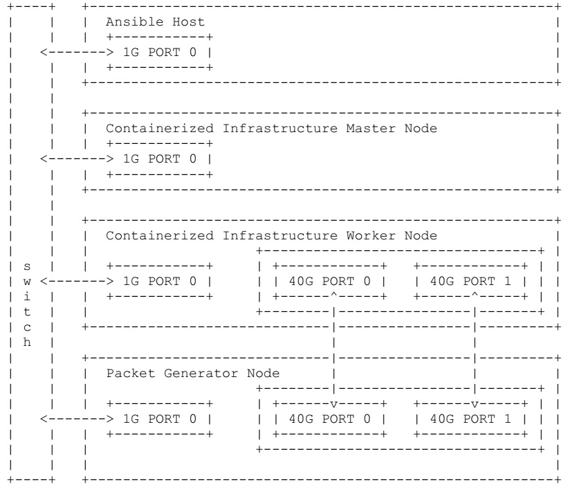

# bmwg-container-network
IETF hackathon 109 
*Contact: Huy Nguyen (huynq.ptit14@gmail.com)*

## Physical Topology

## Hardware specification

| Node Name | Specification  | Description |
| ------------- | ------------- | ------------- |
|Container Control Master node| - Intel(R) Core(TM) i5-6200U CPU  (1socket x 4core)  - MEM 8GB  - DISK 500GB  - Control plane: NIC 1Gb | - Container Deployment and Network Allocation  - Kubernetes Master |
| Conatiner Service Worker node | - Intel(R) Xeon(R E5-2620 v3 @2.4Ghz  (1socket x 6core)  - MEM 128GB  - DISK 2TB  - Control plane: NIC 1Gb  - Data plane: XL710-qda2 (1NIC 2Ports-40Gb) | - Container Service  - Kubernets Worker
| Traffic Generator | - Intel(R) Xeon(R) Gold 6148 @ 2.4Ghz  (2Socket X 20Core)  - MEM 128G  - DISK 2TB  - Control plane: NIC 1Gb  - Data plane: XL710-qda2 (1NIC 2Ports-40Gb) | - Traffic Generator  - TREX v2.82 |

## Software components
| Software Function | Software Component | Link
| ------------- | ------------- | ------------- |
| Host OS | - Master node:  &nbsp;&nbsp;&nbsp;&nbsp; Ubuntu 16.04.7 LTS  &nbsp;&nbsp;&nbsp;&nbsp; Kernel version 4.15.0-122  - Worker node and traffic generator:  &nbsp;&nbsp;&nbsp;&nbsp; CentOS 7.8.2003  &nbsp;&nbsp;&nbsp;&nbsp; Kernel version 3.10.0-1127.19.1.el7.x86_64 | https://ubuntu.com/  https://www.centos.org/ |
| Ansible | Ansible v2.7.16 | https://www.ansible.com/ |
| BMRA ansible playbook | Kubernetes v1.16 branch | https://github.com/intel/container-experience-kits |
| Python | Python 2.7 | https://www.python.org/ |
| Kubespray | Kubespray: v2.12 | https://github.com/kubernetes-sigs/kubespray |
| Docker* | v19.03.13 | https://www.docker.com/ |
| Kubernetes | v1.16.9 | https://github.com/kubernetes/kubernetes |
| CPU manager for Kubernetes | v1.4.0 | https://github.com/intel/CPU-Manager-for-Kubernetes |
| Data Plane Development Kit | v19.11.5 |  http://fast.dpdk.org/rel/dpdk-19.11.5.tar.xz | 
| Multus CNI | MULTUS CNI v3.3 | https://github.com/intel/multus-cni |
| SRIoV CNI | SR-IOV CNI v2.0.0 | https://github.com/intel/sriov-cni |
| SRIoV network device plugin| v3.1 | https://github.com/intel/sriov-network-device-plugin |
| Userspace CNI | v1.2 | https://github.com/intel/userspace-cni-network-plugin |
| Intel Ethernet Drivers | | https://sourceforge.net/projects/e1000/files/iavf%20stable/4.0.1  https://sourceforge.net/projects/e1000/files/i40e%20stable/2.13.10 |
